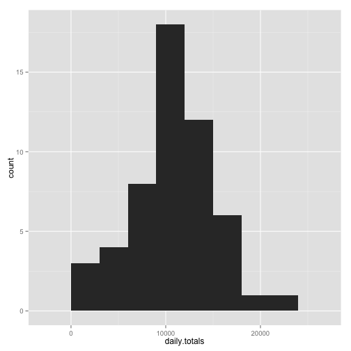
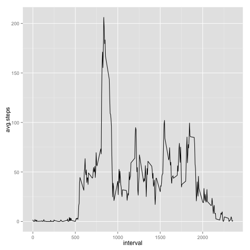
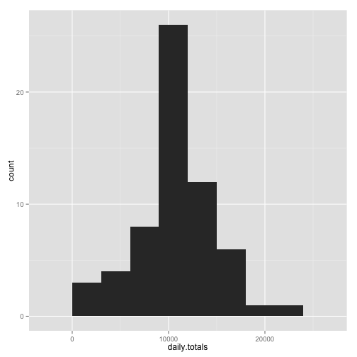
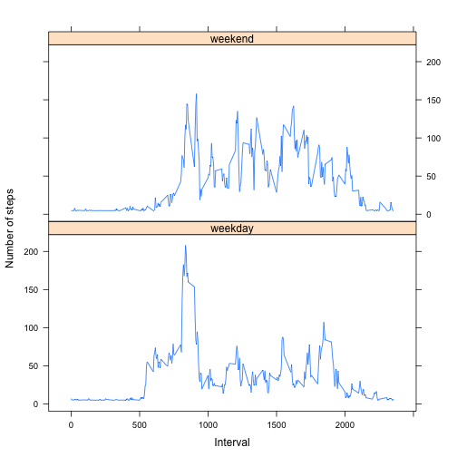

# Reproducible Research: Peer Assessment 1

### set knitr code chunk global options:

```r
opts_chunk$set(echo = TRUE)  ## echo=T is default, but I like it there.
library(ggplot2)
library(lattice)
```


## Loading and preprocessing the data

```r
activity <- read.csv(file = unz("activity.zip", "activity.csv"))
## combine the date and interval into a datetime column
activity$interval <- sprintf("%04d", activity$interval)  # fix to 4 characters 
activity$datetime <- paste(activity$date, activity$interval)
activity$datetime <- strptime(activity$datetime, "%Y-%m-%d %H%M")
# View(activity)
str(activity)
```

```
## 'data.frame':	17568 obs. of  4 variables:
##  $ steps   : int  NA NA NA NA NA NA NA NA NA NA ...
##  $ date    : Factor w/ 61 levels "2012-10-01","2012-10-02",..: 1 1 1 1 1 1 1 1 1 1 ...
##  $ interval: chr  "0000" "0005" "0010" "0015" ...
##  $ datetime: POSIXlt, format: "2012-10-01 00:00:00" "2012-10-01 00:05:00" ...
```


## What is mean total number of steps taken per day?
### Make a histogram of the total number of steps taken each day

```r
daily.totals <- tapply(activity$steps, activity$date, sum)
dt.hist <- qplot(daily.totals, binwidth = 3000)
dt.hist
```

 


### Calculate and report the mean and median total number of steps taken per day

```r
dt.mean <- mean(daily.totals, na.rm = T)
dt.med <- median(daily.totals, na.rm = T)
dt.mean
```

```
## [1] 10766
```

```r
dt.med
```

```
## [1] 10765
```


## What is the average daily activity pattern?

### Make a time series plot of the 5-minute interval and the average number of steps taken, averaged across all days

```r
intervals <- data.frame(tapply(activity$steps, as.factor(activity$interval), 
    mean, na.rm = T))
names(intervals) <- "avg.steps"
# View(intervals)

## make annoying row names into a useful column
intervals <- cbind(interval = as.numeric(rownames(intervals)), intervals)

qplot(interval, avg.steps, data = intervals, geom = "line")
```

 


### Which 5-minute interval, on average across all the days in the dataset, contains the maximum number of steps?

```r
max_interval <- which(intervals == max(intervals$avg.steps), arr.ind = TRUE)
max_interval
```

```
##      row col
## 0835 104   2
```


## Imputing missing values

### Calculate and report the total number of missing values in the dataset (i.e. the total number of rows with NAs)

```r
count_NAs <- sum(is.na(activity))
count_NAs
```

```
## [1] 2304
```


### Devise a strategy for filling in all of the missing values in the dataset.

```r
head(activity$steps)
```

```
## [1] NA NA NA NA NA NA
```

Above we see the NAs.  
Now we'll replace them with the mean.

```r
impute <- function(x, fun) {
    missing <- is.na(x)
    replace(x, missing, fun(x[!missing]))
}
act <- activity
act$steps <- ifelse(is.na(activity$steps), impute(activity$steps, mean), activity$steps)
head(act$steps)
```

```
## [1] 37.38 37.38 37.38 37.38 37.38 37.38
```


### Create a new dataset that is equal to the original dataset but with the missing data filled in.

```r
## The new dataset was created in the previous step.
head(act)
```

```
##   steps       date interval            datetime
## 1 37.38 2012-10-01     0000 2012-10-01 00:00:00
## 2 37.38 2012-10-01     0005 2012-10-01 00:05:00
## 3 37.38 2012-10-01     0010 2012-10-01 00:10:00
## 4 37.38 2012-10-01     0015 2012-10-01 00:15:00
## 5 37.38 2012-10-01     0020 2012-10-01 00:20:00
## 6 37.38 2012-10-01     0025 2012-10-01 00:25:00
```


### Make a histogram of the total number of steps taken each day and Calculate and report the mean and median total number of steps taken per day. Do these values differ from the estimates from the first part of the assignment? What is the impact of imputing missing data on the estimates of the total daily number of steps?

```r
daily.totals <- tapply(act$steps, act$date, sum)
dt.hist <- qplot(daily.totals, binwidth = 3000)
dt.hist
```

 

```r
dt.mean <- mean(daily.totals, na.rm = T)
dt.med <- median(daily.totals, na.rm = T)
dt.mean
```

```
## [1] 10766
```

```r
dt.med
```

```
## [1] 10766
```

Imputing the missing data with the mean made no noticeable difference in the histogram nor the mean; the median is merely one number higher.

## Are there differences in activity patterns between weekdays and weekends?

### Create a new factor variable in the dataset with two levels – “weekday” and “weekend” indicating whether a given date is a weekday or weekend day.

```r
act$day <- factor(weekdays(act$datetime, abbreviate = T))
act$weekday <- factor(ifelse(act$day != "Sat" & act$day != "Sun", "weekday", 
    "weekend"))
str(act$weekday)
```

```
##  Factor w/ 2 levels "weekday","weekend": 1 1 1 1 1 1 1 1 1 1 ...
```

```r
act[1440:1441, ]
```

```
##      steps       date interval            datetime day weekday
## 1440     0 2012-10-05     2355 2012-10-05 23:55:00 Fri weekday
## 1441     0 2012-10-06     0000 2012-10-06 00:00:00 Sat weekend
```

```r
# View(act[1001:2000,])
```


### Make a panel plot containing a time series plot of the 5-minute interval (x-axis) and the average number of steps taken, averaged across all weekday days or weekend days (y-axis).

```r
## get weekday interval averages
wd.act <- subset(act, act$weekday == "weekday")
wd.intervals <- data.frame(tapply(wd.act$steps, as.factor(wd.act$interval), 
    mean, na.rm = T))
names(wd.intervals) <- "avg.steps"
## make annoying row names into a useful column
wd.intervals <- cbind(interval = as.numeric(rownames(wd.intervals)), wd.intervals)
## add weekday col
wd.intervals$weekday <- "weekday"
# View(wd.intervals)

## get weekend interval averages
we.act <- subset(act, act$weekday == "weekend")
we.intervals <- data.frame(tapply(we.act$steps, as.factor(we.act$interval), 
    mean, na.rm = T))
names(we.intervals) <- "avg.steps"
## make annoying row names into a useful column
we.intervals <- cbind(interval = as.numeric(rownames(we.intervals)), we.intervals)
## add weekday col
we.intervals$weekday <- "weekend"
# View(we.intervals)

## combine into one df
both <- rbind(wd.intervals, we.intervals)
both$weekday <- factor(both$weekday)
# View(both)
str(both$weekday)
```

```
##  Factor w/ 2 levels "weekday","weekend": 1 1 1 1 1 1 1 1 1 1 ...
```

```r

xyplot(avg.steps ~ interval | weekday, data = both, type = "l", xlab = "Interval", 
    ylab = "Number of steps", layout = c(1, 2))
```

 

